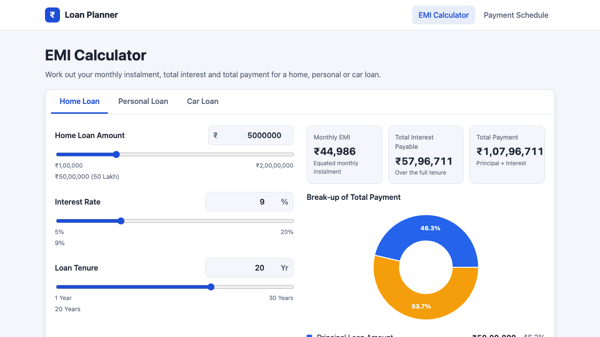

# Test results

Generated by `npm run results` on 2026-10-05.

| | |
| --- | --- |
| **Environment** | Darwin 25.5.0 (arm64) · Node v24.13.0 · Playwright 1.63.0 · Chromium |
| **Type check** | ✅ passed |
| **Lint** | ✅ passed |
| **Unit tests (Vitest)** | ✅ passed: 31 passed (31) |
| **UI + API + SQL (Playwright + Cucumber)** | ✅ passed |

## Playwright + Cucumber scenarios

| Suite | Scenarios | Passed | Expected failures (known defects) | Failed | Flaky |
| --- | --- | --- | --- | --- | --- |
| UI: Loan Planner app (A2) | 41 | 41 | 0 | 0 | 0 |
| API: JSONPlaceholder (A3) | 44 | 23 | 21 | 0 | 0 |
| SQL scenarios (A4) | 31 | 31 | 0 | 0 | 0 |

"Expected failures" are the API checks for the brief's expected behaviour that JSONPlaceholder does not meet.
They are tagged `@known-defect @fail`, and Playwright counts them as passing *because* they failed as
expected. See [docs/API_DEFECTS.md](../docs/API_DEFECTS.md).

## Reports

| Report | How to open |
| --- | --- |
| [Playwright HTML report](playwright-report/) | `npx playwright show-report results/playwright-report` |
| [Cucumber HTML report](cucumber/cucumber-report.html) | open the file in a browser |
| [JUnit XML](junit/results.xml) · [Cucumber JSON](cucumber/cucumber-report.json) | for CI tools |
| [Console logs](logs/) | one log per command above |

In the Cucumber report, the known-defect scenarios show as **failed** (Cucumber has no "expected failure"
status). Each carries a "KNOWN DEFECT: this failure is expected" attachment.

## Screenshots

- [dashboard.png](screenshots/dashboard.png)
- [emi-calculation-25L-10pc-10y.png](screenshots/emi-calculation-25L-10pc-10y.png)
- [pie-chart.png](screenshots/pie-chart.png)
- [bar-chart-tooltip.png](screenshots/bar-chart-tooltip.png)
- [payment-schedule-month-wise.png](screenshots/payment-schedule-month-wise.png)
- [input-validation-error.png](screenshots/input-validation-error.png)
- SQL query outputs and schemas: [sql/screenshots/](../sql/screenshots/)

## Self-healing exercise

| | |
| --- | --- |
| **Broken-locator scenarios** | ❌ fail, as intended (the locators are deliberately broken): [log](logs/self-heal-tests-expected-to-fail.log) |
| **Healer** | 5/5 healed and validated · provider: heuristic (no AI) (auto: fell back to the non-AI matcher because `claude` is not logged in (run: claude auth login)) |
| **Report** | [self-healing/healing-report.md](self-healing/healing-report.md) · [proposed patch](self-healing/locators.patch) |
