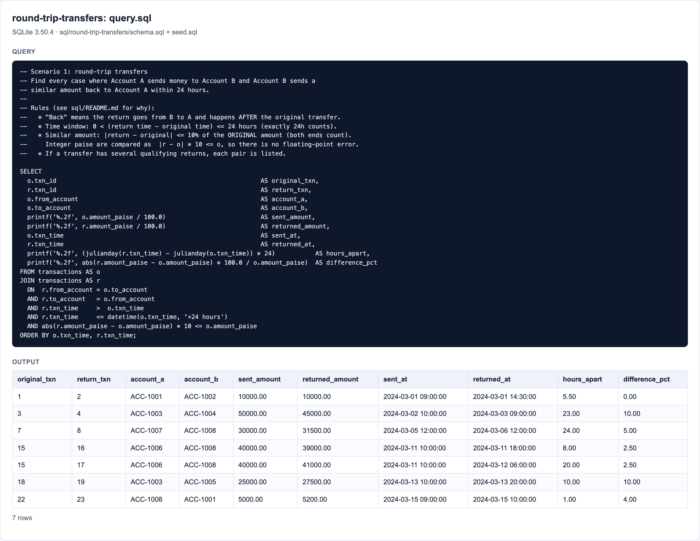
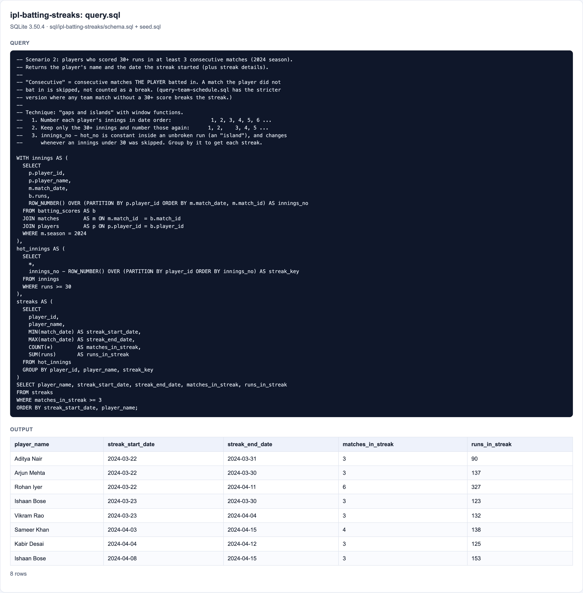

# SQL tests

Two SQL scenarios from the brief (section A4). Each folder holds the table schema, sample data designed
around the edge cases, and the query:

```
sql/
├── round-trip-transfers/      Scenario 1
│   ├── schema.sql             tables, constraints, index
│   ├── seed.sql               sample data: one commented block per edge case
│   └── query.sql              the answer
├── ipl-batting-streaks/       Scenario 2
│   ├── schema.sql
│   ├── seed.sql
│   ├── query.sql              the answer
│   └── query-team-schedule.sql  stricter variant (see "Assumptions")
└── screenshots/               query outputs and schemas, generated by the tests
```

**Database:** SQLite 3.50, through Node's built-in `node:sqlite`, so there is nothing to install. Every run
builds a fresh in-memory database from `schema.sql` + `seed.sql`.

## How to run

```bash
npm run sql         # print every query's output in the terminal
npm run test:sql    # run the automated checks and regenerate the screenshots
```

You can also run the files in any SQLite client (`sqlite3`, DB Browser for SQLite, or an online SQLite
compiler) by running `schema.sql`, then `seed.sql`, then the query.

## Scenario 1: round-trip transfers

> Find instances where Account A sends money to Account B, and Account B sends a similar amount (within 10%)
> back to Account A. Both transactions must happen within a 24-hour window.

**Approach:** a self-join of `transactions`. For each transfer `o` (A → B), find transfers `r` from B back
to A that happen after `o`, at most 24 hours later, with an amount within 10% of `o`'s amount.

**Assumptions** (the brief leaves these open, so each one is written down and tested):

| Question                                     | Decision                                                                                                       |
| -------------------------------------------- | -------------------------------------------------------------------------------------------------------------- |
| 10% of which amount?                         | Of the **original** amount: \|return − original\| ≤ 10% × original. Both ends count (exactly 10% is included). |
| Does the return have to come after?          | **Yes.** Whoever sends first is "Account A". The return must be strictly later.                                |
| Is exactly 24 hours "within 24 hours"?       | **Yes** (`<=`). 24 hours and 1 minute is not.                                                                  |
| Several qualifying returns for one transfer? | **Each pair is listed**, so an investigator sees every candidate.                                              |
| Money type                                   | Stored as **integer paise**, never as floats. The 10% test is `abs(r − o) × 10 ≤ o`, exact integer maths.      |

**Result:** 7 round trips. Screenshots: [query output](screenshots/round-trip-transfers.png),
[schema](screenshots/round-trip-transfers-schema.png).



## Scenario 2: IPL batting streaks

> Using an IPL-style dataset for the 2024 season, identify players who scored 30+ runs in at least 3
> consecutive matches. Return the player's name and the date the scoring streak commenced.

**Approach: "gaps and islands"** with window functions:

1. Number each player's 2024 innings in date order with `ROW_NUMBER()`: 1, 2, 3, 4, 5, 6 …
2. Keep only innings with 30+ runs and number them again: 1, 2, _, 3, 4, 5 …
3. `innings_no − hot_no` stays the same within an unbroken run and changes after any innings under 30.
   Grouping by it gives each streak. Keep streaks of 3+ matches, starting at `MIN(match_date)`.

This returns **one row per streak**. A 6-match run is one streak, not four overlapping 3-match windows, and
a player with two separate streaks gets two rows.

**Assumptions:**

| Question                              | Decision                                                                                                                                                                                                                             |
| ------------------------------------- | ------------------------------------------------------------------------------------------------------------------------------------------------------------------------------------------------------------------------------------ |
| "30+" includes exactly 30?            | **Yes** (`runs >= 30`).                                                                                                                                                                                                              |
| "Consecutive matches": whose matches? | `query.sql`: consecutive matches **the player batted in**. A team match the player missed is skipped. `query-team-schedule.sql`: consecutive matches **of the player's team**, so a missed match breaks the streak. Both are tested. |
| Matches from other seasons?           | **Ignored.** Only `season = 2024` counts, so a run that starts in 2023 does not carry over.                                                                                                                                          |
| Extra columns?                        | The required columns come first (`player_name`, `streak_start_date`). The end date, match count and runs are added for context.                                                                                                      |

**Result:** 8 streaks (7 with the stricter variant, where Vikram Rao's streak is broken by a missed match).
Screenshots: [query output](screenshots/ipl-batting-streaks.png),
[stricter variant](screenshots/ipl-batting-streaks-team-schedule.png),
[schema](screenshots/ipl-batting-streaks-schema.png).



## How the queries are tested

[`tests/features/sql/`](../tests/features/sql) holds Cucumber scenarios that run against a fresh database:

- **Exact output:** every row and column, in order, must match the expected table in the feature file.
- **One rule check per edge case** (e.g. "a return 24 hours and 1 minute later is not reported", "2023
  matches are ignored"), so a failure names the broken rule.
- **Schema constraints:** zero amounts, sending to yourself, unknown accounts, bad timestamps and NULL keys
  are rejected.
- **Screenshots:** the output and the schema are rendered from the real query result and saved in
  `screenshots/`.

**The checks were shown to catch real mistakes.** Each of these common bugs was put into a query
temporarily, and the tests failed every time:

| Deliberate mistake                                | Failing checks |
| ------------------------------------------------- | -------------- |
| Exactly-24-hours excluded (`<` instead of `<=`)   | 2              |
| Exactly-10% excluded (`<` instead of `<=`)        | 3              |
| Return allowed _before_ the original              | 2              |
| Season filter forgotten (2023 matches included)   | 2              |
| Exactly 30 runs not counted (`>` instead of `>=`) | 3              |

## Note on portability

The queries are standard SQL apart from SQLite's date and format functions in scenario 1. In PostgreSQL
you would use `r.txn_time <= o.txn_time + INTERVAL '24 hours'`, `EXTRACT(EPOCH FROM r.txn_time -
o.txn_time) / 3600` for hours, and `to_char`/`round` instead of `printf`. Scenario 2 uses only standard
window functions (`ROW_NUMBER() OVER`), so it should port with little or no change, but it has only been run
on SQLite here.
